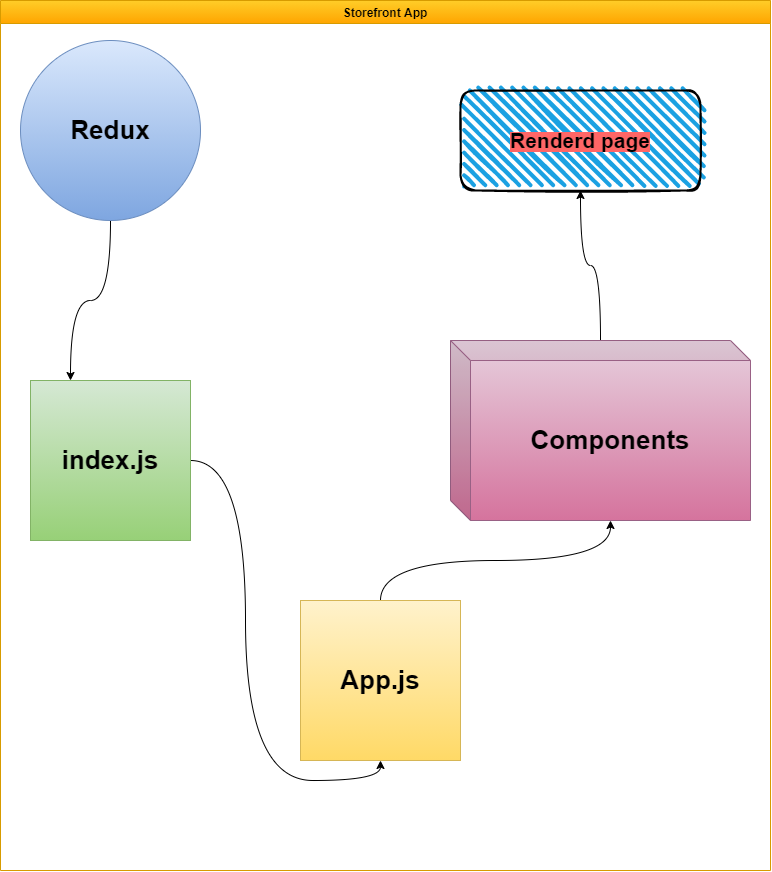

# storefront

---
[Pull Request 1](https://github.com/ibrahemomari/storefront/pull/2)

[Pull Request 2](https://github.com/ibrahemomari/storefront/pull/3)

[Pull Request 3](https://github.com/ibrahemomari/storefront/pull/4)

---

[CodeSandbox phase 1](https://c8yfx.csb.app/)

[CodeSandbox phase 2](https://ysd6w.csb.app/)

[CodeSandbox phase 3]()

---

Install Dependences
===
>npm install

---
Run:
===
>npm start
---
UML
==

